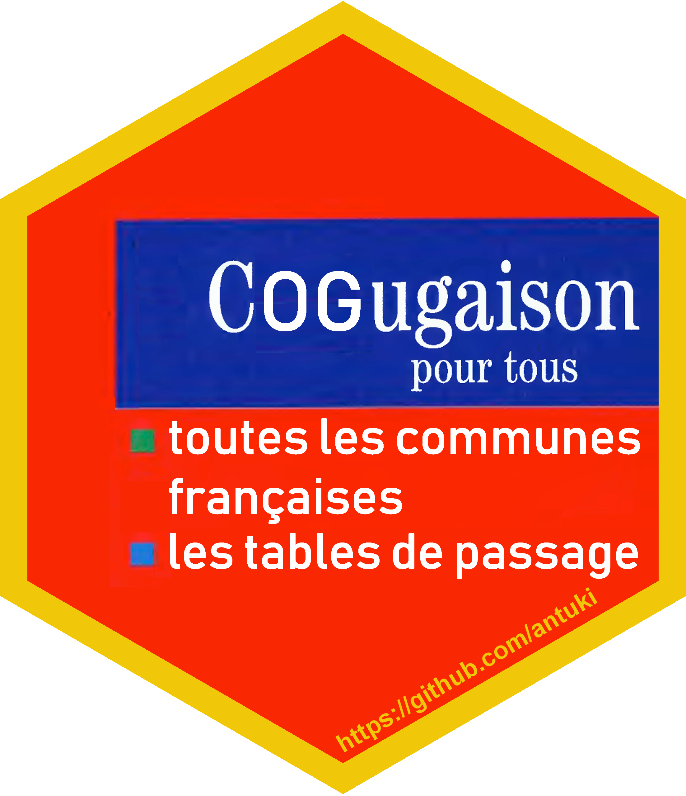

# COGugaison 

*Afin de mieux connaître les utilisateurs des packages COGugaison et CARTElette et de mieux répondre à vos besoins, merci de répondre à cette rapide enquête en ligne* : https://antuki.github.io/2019/11/08/opinion_package/

Le découpage des territoires français, en particulier les communes, n'est pas un phénomène immuable. Chaque année certaines communes changent de codes, ou bien de nom, fusionnent ou encore se divisent. Certains périmètres supra-communaux changent également, comme celui des cantons qui a été récemment redéfini. C'est à l'Insee que revient le suivi de ces changements afin d'établir chaque année le code officiel géographique (COG).

Ce package R a alors pour objectif global de manipuler des données communales produites à différents millésimes et de les agréger à différents niveaux supra-communaux. Plus précisément, il permet actuellement de : 

- détecter le millésime du code officiel géographique d'une table de données communales : fonction `COG_akinator` et apparier une liste de communes d'une base de données avec celle du COG d'un millésime donné avec `apparier_COG`
- visualiser les modifications communales (fusions, défusions, changements de codes ou de noms) qui ont eu lieu entre deux dates : `modifications_communales`  
- visualiser sur un graphique interactif la trajectoire d'une commune donnée, c'est-à-dire toutes les modifications qui ont eu lieu depuis 1968 : `trajectoire_commune` et `trajectoire_commune_shiny`.
- transformer des tables de données numériques en géographie au premier janvier d'une année souhaitée : `changement_COG_varNum`. 
- transformer des typologies de communes en géographie au premier janvier d'une année souhaitée en ayant le choix entre plusieurs hypothèses de classement en cas de fusion de communes de classes différentes (attribuer une unique classe à toutes les communes fusionnées, attribuer la classe qui contient le plus de population, définir une classe absorbante, une classe absorbée ou une classe spécifique aux regroupements de plusieurs communes de classes différentes) : `changement_COG_typo`. Il est également possible d'isoler dans une table les communes fusionnées appartenant à des classes différentes : `changement_COG_typo_details`.
- permettre d'agréger les tables de données communales à de nombreux échelons supra-communaux administratifs (EPCI, arrondissements, cantons-villes, départements, régions) ou d'étude (bassins de vie, zones d'emploi, unités urbaines, aires urbaines) : `nivsupra`. 
- gérer des cas particuliers comme les codes Insee des communes corses (`modification_Corse`) ou des arrondissements municipaux de Paris, Lyon, et Marseille (`enlever_PLM`) ou encore l'ancienne commune de l'Oudon (`modification_Oudon`)

Il est important de souligner que les données utilisées ici s'appuient sur des tables publiées par l'Insee :
- [l'historique des géographies communales](https://www.insee.fr/fr/information/2666684#titre-bloc-11)
- [les tables d'appartenance des communes aux différents niveaux géographiques](https://www.insee.fr/fr/information/2028028)

Tant que le package n'est pas stabilisé, il est évidemment conseillé de se référer aux données officielles de l'Insee en cas de doute sur un résultat.  

Pour installer le package `COGugaison` et le charger dans R :
 
```r
devtools::install_github("antuki/COGugaison")
library(COGugaison)
```
